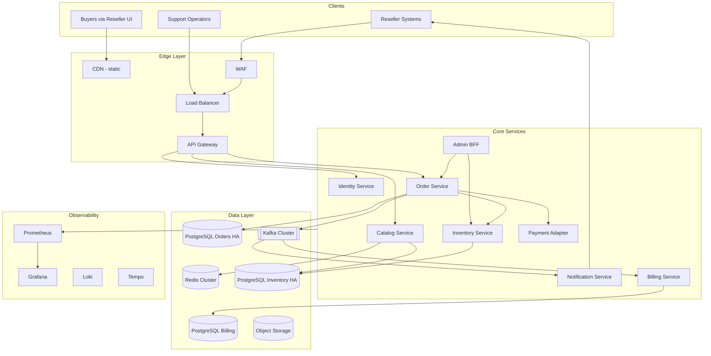
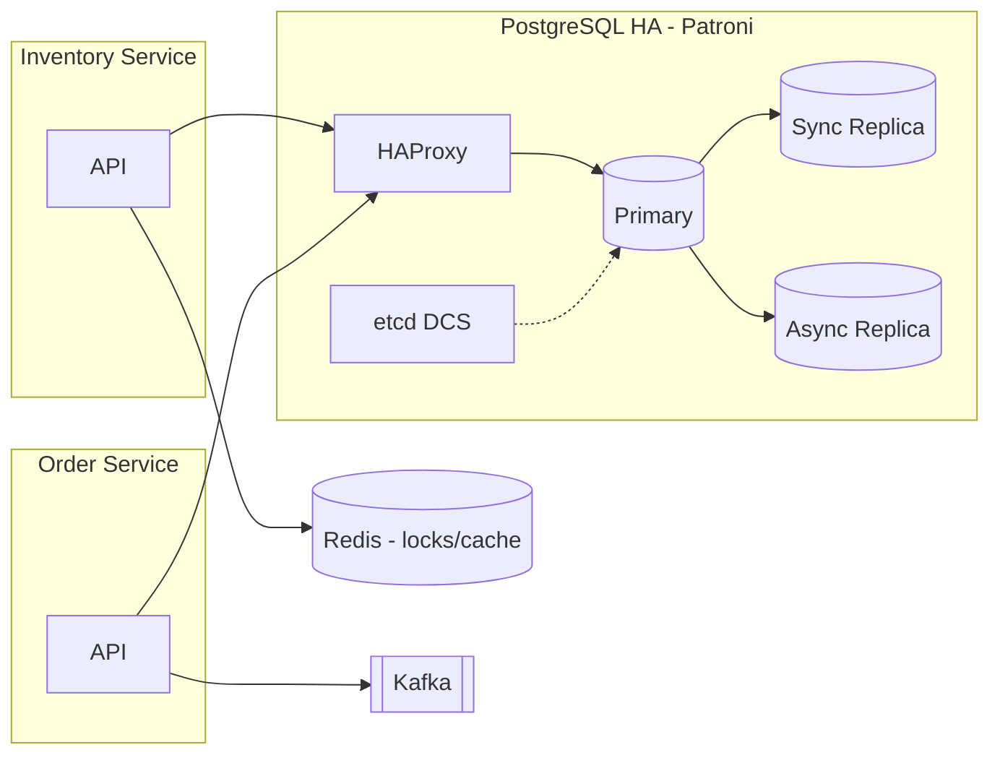
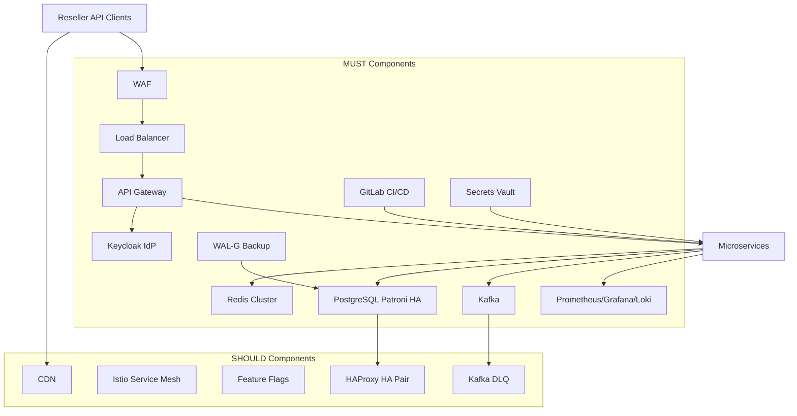

# HW2 - High Level Design: Ticket to Serve

Отчёт по теоретическому заданию.

---

## Part 1 - Модули, интеграции, способ взаимодействия

### 1.1. Декомпозиция (DDD + Event Storming)

**Домены (bounded contexts):**

| Домен | Агрегаты | Ответственность |
|-------|----------|-----------------|
| **Catalog** | Show, Venue | Афиша, расписание, метаданные шоу |
| **Inventory** | Seat, Ticket, Hold | Состояние мест, резерв, антидубль |
| **Sales** | Order, Payment | Оформление, оплата, идемпотентность |
| **Partner** | Reseller, APIKey, Webhook | Интеграции реселлеров |
| **Billing** | Fee, Payout, Report | Комиссии, взаиморасчёты |
| **Support** | Ticket, AuditLog | Операции поддержки |
| **Identity** | User, Role | AuthN/AuthZ |

**Event Storming - ключевые события:**
- `SeatReserved` -> `PaymentCaptured` -> `TicketSold` -> `WebhookDispatched`
- `SeatReleased` (TTL истёк) → `SubscriptionNotified`
- `PaymentFlagged` (фрод) → `ResellerAlerted`

### 1.2. Сервисы (микросервисы MVP)

| # | Сервис | Обоснование выделения |
|---|--------|----------------------|
| 1 | **API Gateway** | Единая точка входа, rate limit, mTLS, OpenAPI |
| 2 | **Identity Service (IdP)** | OAuth 2.0 / API keys для реселлеров, RBAC |
| 3 | **Catalog Service** | Read-heavy каталог шоу (отдельное масштабирование) |
| 4 | **Inventory Service** | Write-critical: lock мест, состояние билетов |
| 5 | **Order Service** | Saga покупки, идемпотентность, связь с платежами |
| 6 | **Payment Adapter** | Интеграция СБП/эквайринг, PCI scope isolation |
| 7 | **Notification Service** | Webhooks реселлерам, SSE покупателям |
| 8 | **Billing Service** | Fee, отчёты, акты |
| 9 | **Admin Portal (BFF)** | UI поддержки, audit log |
| 10 | **Event Bus** | Асинхронная шина событий |

### 1.3. Интеграции и способ взаимодействия

| Связь | Тип | Протокол | Обоснование |
|-------|-----|----------|-------------|
| Реселлер -> API Gateway | **Синхронный** | HTTPS REST | Запрос-ответ, latency < 300 ms, идемпотентные POST |
| API Gateway -> Identity | **Синхронный** | gRPC / REST | Проверка JWT/API-key на каждый запрос - нужен немедленный ответ |
| Catalog Service -> Redis | **Синхронный** | Redis protocol | Кэш горячего каталога, снижение нагрузки на БД |
| Order -> Inventory | **Синхронный** | gRPC | Резерв места должен быть атомарным в рамках запроса покупки |
| Order -> Payment Adapter | **Синхронный** (инициация) + **асинхронный** (callback) | REST + webhook | Синхронно: создать платёж; асинхронно: подтверждение от банка |
| Order -> Event Bus | **Асинхронный** | Kafka | `TicketSold` - не блокировать ответ клиенту |
| Notification <- Event Bus | **Асинхронный** | Kafka consumer | Webhooks с retry, DLQ |
| Billing <- Event Bus | **Асинхронный** | Kafka consumer | Fee начисляется после подтверждения оплаты |
| Admin Portal -> сервисы | **Синхронный** | REST через BFF | Операции поддержки требуют немедленного ответа |
| Inventory -> Inventory (replica) | **Асинхронный** | PG streaming replication | Репликация данных для HA |

**Почему не всё синхронно:** 

webhooks и billing не должны увеличивать latency покупки. 

**Почему не всё асинхронно:** 

резерв места требует немедленного ответа «да/нет» - иначе двойная продажа.

### 1.4. HLD - диаграмма C4 (Level 1–2)

---

## Part 2 - Выбор БД, репликация, шардинг

### 2.1. Алгоритм выбора БД (по занятию)

Для каждого сервиса оцениваем:

1. **Модель данных** - реляционная / документная / key-value / граф
2. **Паттерн доступа** - read/write ratio, нужны ли транзакции ACID
3. **Latency / throughput** - из расчёта HW1 (пик ~2 500 RPS read, ~5.5 TPS write)
4. **Консистентность** - strong (inventory) vs eventual (notifications)
5. **Объём** - метаданные ~180 ГБ/год, события ~100 ГБ/год

### 2.2. Матрица выбора

| Сервис | Сценарий | Выбор БД | Обоснование |
|--------|----------|----------|-------------|
| **Inventory** | Резерв места, `SELECT FOR UPDATE`, антидубль | **PostgreSQL** (Patroni HA) | ACID, row-level lock, проверенная надёжность; критична корректность |
| **Order** | Транзакции заказа, идемпотентность | **PostgreSQL** (Patroni HA) | ACID, FK к inventory, saga state |
| **Catalog** | Read-heavy, фильтры по шоу/дате | **PostgreSQL** + **Redis** cache | PG - source of truth; Redis - кэш каталога (TTL 30–60 с) |
| **Billing** | Отчёты, агрегации, ACID | **PostgreSQL** | Финансовые данные, транзакции, соответствие 54-ФЗ |
| **Notification** | Очередь webhooks, retry | **Kafka** + Redis (dedup) | At-least-once delivery, DLQ, не блокирует write path |
| **Identity** | API keys, sessions, RBAC | **PostgreSQL** или **Keycloak** (встроенная PG) | Стандартный IdP, OAuth |
| **Audit Log** | Append-only, неизменяемый | **PostgreSQL** (partitioned) или **ClickHouse** | Append-only; ClickHouse для аналитики по логам при росте |
| **Search** (фаза 2) | Полнотекстовый поиск шоу | **OpenSearch** | Нечёткий поиск, фасеты |

### 2.3. Репликация

| БД | Стратегия | RPO / RTO | Обоснование |
|----|-----------|-----------|-------------|
| **PostgreSQL Inventory** | Patroni + etcd, 1 Leader + 2 Sync Replica | RPO < 1 мин, RTO < 15 мин | Inventory - самый критичный store; sync replica для минимальной потери |
| **PostgreSQL Orders** | Patroni, async replica + WAL-G backup | RPO < 5 мин, RTO < 15 мин | Меньше write TPS, но финансовая значимость |
| **Redis** | Redis Sentinel / Cluster, 3+ nodes | RPO ≈ 0 (in-memory), RTO < 1 мин | Кэш можно пересобрать, но locks/idempotency keys - критичны |
| **Kafka** | 3 brokers, replication factor = 3 | RPO = 0 (acks=all) | События не должны теряться |

Связь с HW2 practice: архитектура Inventory/Orders в проде повторяет паттерн **Patroni + etcd + HAProxy**, который мы тестировали в `postgres-ha`.

### 2.4. Шардинг

| Данные | Ключ шардинга | Когда | Обоснование |
|--------|---------------|-------|-------------|
| **Inventory (seats)** | `show_id` | При > 10M мест или > 1K TPS write | Локализация hot-spot одного концерта на один шард |
| **Orders** | `reseller_id` + time | При > 10M транзакций/мес | Равномерное распределение по реселлерам |
| **Events (Kafka)** | `show_id` | С роста | Порядок событий в рамках одного шоу |
| **Audit log** | `created_at` (partitioning) | С первого дня | Партиции по месяцам, TTL 3 года (ФЗ-152) |

На старте (MVP): **один Patroni-кластер** без шардинга - нагрузка ~5.5 TPS write укладывается.

### 2.5. C4 Level 3 - данные на схеме

---

## Part 3 - Дополнительные компоненты HLD

### 3.1. MUST (обязательные)

| Компонент | Обоснование | Реализация (РФ 2026) |
|-----------|-------------|---------------------|
| **Load Balancer** | 2 500 RPS пик, горизонтальное масштабирование API | Yandex Application Load Balancer |
| **API Gateway** | Rate limiting, mTLS для реселлеров, единый OpenAPI | Kong / Tyk (on-prem в YC) |
| **WAF** | Защита от OWASP Top 10, DDoS (NFR) | Yandex Cloud WAF / Curator |
| **IdP** | Централизованная аутентификация, RBAC, 2FA для admin | Keycloak (self-hosted в РФ) |
| **Кэш (Redis)** | Каталог read-heavy; distributed locks для seat_id | Yandex Managed Redis / self-hosted Sentinel |
| **Event Bus (Kafka)** | Асинхронные webhooks, billing, decoupling | Yandex Data Streams / Platform V |
| **PostgreSQL HA** | RPO < 1 мин, автоматический failover (Inventory, Orders) | Patroni + etcd + HAProxy (как в demo) |
| **Обзервабилити** | RPS, latency, бизнес-метрика «двойная продажа», трейсы | Prometheus + Grafana + Loki + Tempo (или Yandex Monitoring) |
| **CI/CD** | Автодеплой, security scan, снижение human error | GitLab CI (импортозамещение GitHub) |
| **Резервное копирование** | RPO, ФЗ-152, восстановление | WAL-G → Yandex Object Storage, daily snapshots |
| **Secrets Management** | API keys, DB credentials, PCI scope | HashiCorp Vault / Yandex Lockbox |
| **Audit Log** | Неизменяемый журнал операций поддержки (ИБ) | Append-only PG partition / ClickHouse |

### 3.2. SHOULD (рекомендуемые)

| Компонент | Обоснование | Реализация |
|-----------|-------------|------------|
| **CDN** | Статика витрин реселлеров, снижение latency | Yandex CDN |
| **Service Mesh** | > 8 сервисов - retries, circuit breaker, mTLS | Istio (при росте команды) |
| **API Rate Limiter (distributed)** | Защита от abuse реселлеров | Redis + Gateway plugin |
| **Feature Flags** | Безопасный rollout (новые fee-правила) | Unleash (self-hosted) |
| **Geo DNS** | При расширении в СНГ | Yandex DNS гео-маршрутизация |
| **Dead Letter Queue** | Недоставленные webhooks | Kafka DLQ topic |
| **HAProxy HA** | Убрать SPOF (урок HW2 practice) | Keepalived + 2 HAProxy nodes |

### 3.3. Полная HLD-схема (C4 Container + инфраструктура)

---

## Итог

| Part | Результат |
|------|-----------|
| **Part 1** | 10 сервисов, sync для критичного пути (reserve/buy), async для webhooks/billing |
| **Part 2** | PostgreSQL HA для ACID-данных, Redis для кэша/locks, Kafka для событий; шардинг по `show_id` при росте |
| **Part 3** | 12 MUST-компонентов (включая Patroni HA из практики), 7 SHOULD |

Связь практики и теории: Patroni-кластер из `postgres-ha` - это production-паттерн для **Inventory** и **Order** PostgreSQL в Ticket to Serve. HAProxy в паре (SHOULD) закрывает SPOF, обнаруженный в HW2 practice.
